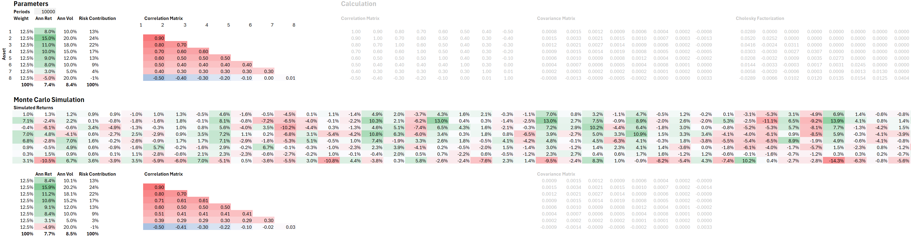
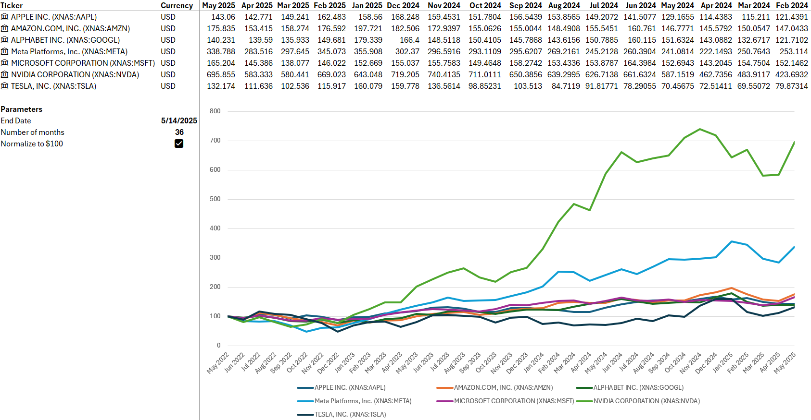
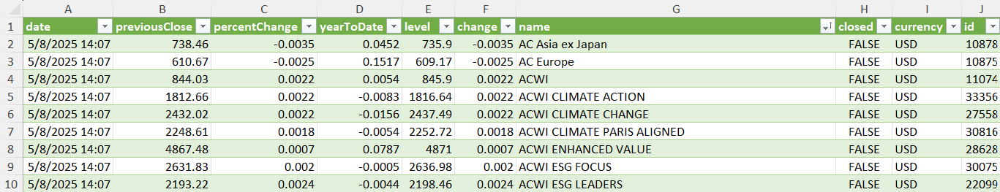
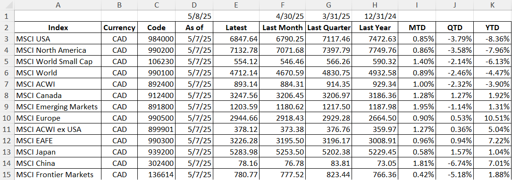
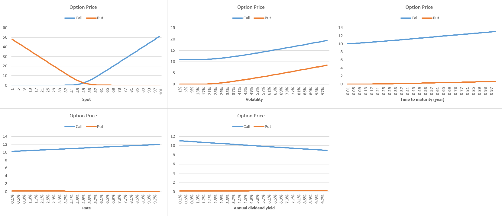
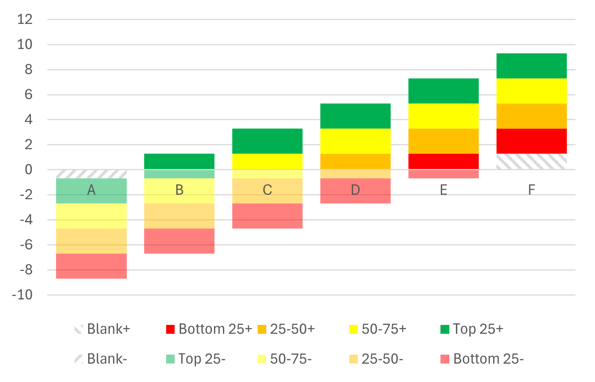
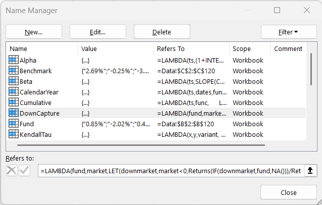

# Financial Toolkit in Excel

> [!TIP]
> What's new? [Monte Carlo Simulation](#) (1/11)

## Project 6: Monte Carlo Simulation for Portfolio Risk Analysis

The [Monte Carlo.xlsx](Monte%20Carlo.xlsx) spreadsheet implements a Monte Carlo simulation to analyze portfolio risk. Users input asset weights, expected returns, volatilities, and a correlation matrix, which is transformed via Cholesky decomposition into a correlation generator. This transformation converts independent random draws into correlated asset returns, allowing the simulation to generate thousands of realistic portfolio outcomes and assess the distribution of potential risks and returns.



## Project 5: Stock Monitor

The [Stock Monitor](Stock%20Monitor.xlsx) report utilizes Excel’s built-in `Stock` data type and `STOCKHISTORY` formula to retrieve historical stock prices and visualize them using a line chart. A checkbox option allows users to normalize starting prices to $100, making it easier to compare the relative performance of different stocks over time.



## Project 4: MSCI Index Data

### Real time index data

The [MSCI Real Time Index.xlsx](MSCI%20Real%20Time%20Index.xlsx) spreadsheet uses Power Query to retrieve real-time performance data from the [MSCI website](https://www.msci.com/real-time-index-data-search) and displays it in a table format. The data is delayed by 20 minutes and is refreshed every minute. The base currency is predetermined and not user-configurable.



### End of day index data

The [MSCI End of Day Index.xlsx](MSCI%20End%20of%20Day%20Index.xlsx) spreadsheet uses Power Query to retrieve end-of-day performance data from the [MSCI website](https://www.msci.com/end-of-day-data-search). The table presents performance data as price returns in CAD terms by default. However, the index variant (e.g., net or gross total return), currency, data frequency, as well as the start and end dates are all user-configurable.



## Project 3: Black Scholes Model

The [bsm.xlsx](bsm.xlsx) spreadsheet demonstrates how theoretical option values, based on the Black-Scholes model, change with variations in a single input while keeping all other inputs constant.



## Project 2: Quartile Chart (Stacked Column Chart) with Negative Values

Excel's built-in stacked column chart cannot span across the X-axis. To work around this limitation, we create two series (positive and negative) along with a blank series. In the [quartile.xlsx](quartile.xlsx) spreadsheet, we used dynamic array formulas to generate the required series.



Credit: https://peltiertech.com/Excel/Charts/StackedColumnsAboveAndBelow.html

## Project 1: Time Series Analysis

The Excel spreadsheet [ftk.xlsx](ftk.xlsx) implements around 70 most commonly used functions for time series analysis. All functions are, written in plain Excel formulas as lambda functions, and stored in named ranges. No auxiliary cells or columns are used, and no VBA is involved.



Functions are classified in the following categories:

1. Performance
2. Risk
3. Regression
4. Efficiency
5. Value at Risk
6. Time Horizon - These generic functions works in conjunction with the risk and performance functions above to provide comprehensive analysis across multiple periods.

For details, please refer to [the formula sheet](formula.md).

The spreadsheet provides Python implementations of the same functions for comparison and extended analysis.

## Project 0: Miscellaneous Tools

The [Analytics.xlsx](Analytics.xlsx) spreadsheet contains various financial tools, including:

1. **Geltner unsmoothing** that removes appraisal smoothing by modeling observed returns as an AR(1) process and inverting the autocorrelation to recover the underlying economic return series

```math
R_{t,\text{true}} = \frac{R_{t,\text{reported}} - \rho R_{t-1,\text{reported}}}{1-\rho}

```

2. **Carino smoothing** that converts multi-period compounded returns into additive period returns

```math
k = \begin{cases}
\dfrac{ln(1+r) - ln(1+b)}{r-b} & \text{if } r \neq b \\
1 & \text{if } r = b
\end{cases}
```